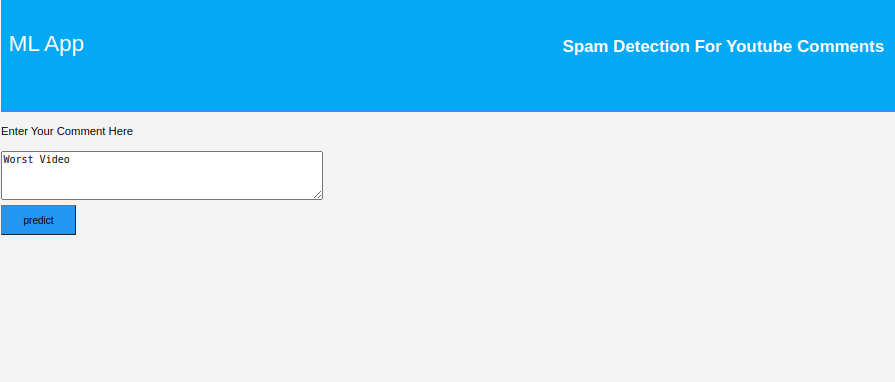

# Youtube_Comments_Spam_Detection

## Directly Run (Command Line)
1. Download this repository and extract the file
2. Write fallowing commands on terminal
```javascript
    python3 app.py
``` 
4. Click on the given url and open on browser

## Screenshot



## How to run (Google Collab)
1. Download this repository and extract the file
2. Go to (https://colab.research.google.com) and click the blue button that says 'New Notebook'
3. Give your project a name. Do not use the dash symbol '-', but rather the underscore '_', because the name of the repo will become the name of your Python module.
4. Click on 'File' section and then choose 'Open Notebook' option
5. Upload "project.ipynb" file\
6. Mount Drive
```javascript
    from google.colab import drive
    drive.mount('/content/drive')
```  
7. Upload dataset on drive
8. Pass the dataset path ('/content/drive/My Drive/---.csv') and load the dataset into collab
9. Run all blocks

## How to run (Jupyter Notebook - Anaconda)
1. Download this repository and extract the file
2. Go to (https://www.anaconda.com/distribution/) and download anaconda 
3. Run the Script 
```javascript
 bash Anaconda3-2020.07-Linux-x86_64.sh
```  
4. Finalize the Installation Process (Choose Location)
5. Set Up Anaconda Environments
```javascript
 conda create --name user_environment python=3
 conda activate user_environment
``` 
6. Then go to terminal/cmd prompt and navigate to your project folder 
7. Run ('jupyter notebook') commenad
8. Open dataset and 'project.ipynb' file from folder
8. Pass the dataset path ('/home/Downloads/Projects/---.csv') and load the dataset into jupyter notebook
9. Run all blocks
